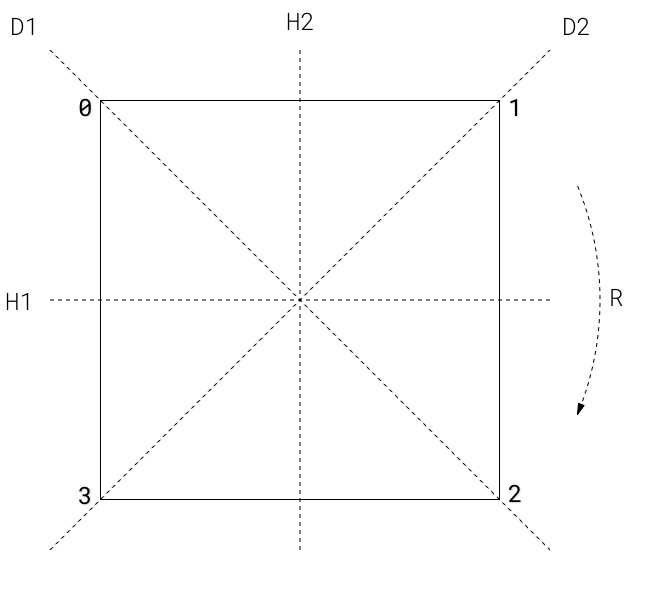

# Javascript and Group Theory

Javascript was invented in 1995 by Brandon Eich, in order to automate HTML presentations in Netscape Navigator. Since then, Javascript interpreters have been built into virtually every internet browser. The language has been standardized by a committee, and receives enhancements and improvements to this day.

One of the interesting aspects of the Javascript programming language is a data-structure known of colloquially as a **dictionary**. We'll look closely at the dictionary, and then use it to investigate a topic in Mathematics, called a **permutation group**.

## Getting Started

### Opening The Command Line

A Javascript **command line** is a text interface for giving commands to a Javascript interpreter. The interpreter reads the command, evaluates the order, prints its results, and then readies itself for a new line. You can use the command line to quickly test small bits of code for correctness.

To open the Javascript command line in Chrome, go to **View -> Developer -> Javascript Console**. You will be presented with a blank page and a blinking cursor. The page will hold your old commands as you type them.

### Warming Up

Let's try a few commands. Try entering the number `17` on the command line, and then hit enter. The result should look like.

```
> 17
< 17
```

The right caret means that `17` went in and the left caret below means that `17` came out. Let's enter a decimal, like `10.23`

```
> 10.23
< 10.23
```

We see that Javascript reflects numbers back at us.

Let's type a word...

```
> zardoz
< Uncaught ReferenceError: zardoz is not defined
```

Javascript has given us an error. The error has to do with references and defining the word zardoz.

### Definitions

To explain better the error we have received, I will explain how to define a reference. In this case, the reference we want to define is the word zardoz. It does not matter what we define it to be, so I will use the number 77. To define zardoz as a reference to the number 77, I type

```
> zardoz = 77
< 77
```

Now, if I type `zardoz`, I get:

```
> zardoz
< 77
```

and there is no error! We see that words can be defined, and that our error meant we had not defined the word we intended to use.


## Dictionaries

So let's say I define a bunch of words to be a bunch of numbers. In the end, I produce my own language for referring to numbers. If I want to transmit this language to another person, I have to show them my definitions.

This object, a collection of definitions, is the dictionary, and in Javascript it looks like:

```
{ zardoz: 77, foobar: 1.13, foobarbaz: 3 }
```

Sometimes we break after the commas, like so:

```
{ zardoz: 77,
  foobar: 1.13,
  foobarbaz: 3 }
```

We can even define words to be references to dictionaries:

```
english_decimal = {
  zero: 0,
  one: 1,
  two: 2,
  three: 3,
  four: 4,
  five: 5,
  six: 6,
  seven: 7,
  eight: 8,
  nine: 9 }
```

Now we have a dictionary of the ten digits in the English decimal system.

### Looking up a definition.

Let's say we have another dictionary:

```
portuguese_decimal = {
  zero: 0,
  um: 1,
  dois: 2,
  três: 3,
  quatro: 4,
  cinco: 5,
  seis: 6,
  sete: 7,
  oito: 8,
  nove: 9 }
```

Suppose I am asked to pick "três" onions from the store. I can lookup the definition of "três" like so:

```
> portuguese_decimal["três"]
< 3
```

I wrote the name of the dictionary, followed by an `[`, an `"`, the name of the term I'm looking for, and then closing with an `"` and a `]`. The `[` and `]` are called **square brackets**.

The quotation marks are important here. A word not encapsulated in quotes is expected to reference, or **signify** some other, underlying value (like the number 77 was signified by the word `zardoz`). However, when we refer to the word, "zardoz", we do not mean 77. Instead, we mean the *literal word*, "zardoz". Quotes are a way of referring to the **signifier** itself.

### Dictionaries of Numbers

Say we want to have the reverse of `portuguese_decimal`, that is, a dictionary that lets us look up the Portuguese word for a particular digit. Then we should write something like

```
decimals_in_portuguese = {
  0: "zero",
  1: "um",
  2: "dois",
  3: "três",
  4: "quatro",
  5: "cinco",
  6: "seis",
  7: "sete",
  8: "oito",
  9: "nove" }
```

Now, when we need the Portuguese word for 8, we type:

```
< decimals_in_portuguese[8]
> "oito"
```
The above can be read: "Look up the number 8 in the dictionary of decimals in portuguese." The response is of course, `"oito"`.


The `decimals_in_portuguese` dictionary is special. Because the numbers start from 0 and run in order, we can save some keystrokes by using a slightly different structure:

```
decimals_in_portuguese_as_array = [
  "zero",
  "um",
  "dois",
  "três",
  "quatro",
  "cinco",
  "seis",
  "sete",
  "oito",
  "nove" ]
```

This is an **array**, made with square brackets instead of curly brackets, and omitting the digits from the left-hand side of the definition. An array is like a dictionary that automatically fills in the numbers on the left. The result is less typing, and actually, less overall memory usage!

The array behaves exactly like its dictionary counterpart; Typing `decimals_in_portuguese_array[8]` also yields `"oito"`. We can assert this in the command line with an **equality sign**, (`==`),  by typing

```
< decimals_in_portuguese[8] == decimals_in_portuguese_as_array[8]
> true
```


Now we can use these tools to explore a foundational topic in Mathematics, i.e. Group Theory.


## Ex. 1. The Square.



Let's observe what is in the picture.

1. A square, with corners labelled `0`, `1`, `2`, and `3`.
2. Two diagonal lines, labelled `D1` and `D2`.
3. A horizontal and vertical line, labelled `H1` and `H2` respectively, and
4. An arc, `R`, that is pivoting around the center of the square.

These lines correspond to the symmetries of the square.

### Symmetry

Imagine a perfectly square tile is placed on a table. You rotate the tile one quarter turn. It looks exactly the same.

You pick the tile up, flip it, end over end, across its horizontal axis, and put it down. It looks exactly the same.

You do the same with its vertical axis, and the two diagonal axes. All of these actions result in the tile laying exactly the same.

These actions are called **automorphisms**, roughly, self-transformations, because they start with one thing, and they end up with the same thing.

### Predicting where the corners will go

Thinking about the square, we know that, even our tile looks the same after we do one of these automorphisms, the corners are in different places. 

For instance, when rotating the tile one quarter-turn: corner 3 receives corner 2, corner 2 receives corner 1, corner 1 receives corner 0, and corner 0 receives corner 3.

I want to define this "receives" relationship. I'm going to use a dictionary.

```
receives = {
  3: 0,
  2: 1,
  1: 2,
  0: 1 }
```

Now placing a finger on 

```
> receives[3]
< 0
```

I can ask my dictionary about any corner:

```
> receives[0]
< 1
> receives[1]
< 2
> receives[2]
< 3
> receives[3]
> 0
```

This thoroughly defines the action of the automorphism that is `R` (rotation). 

### Further reasoning

If the prior dictionary described `R`, we should define it as `R`.

```
R = {
  3: 0,
  2: 1,
  1: 2,
  0: 1 }
```

This is good, but going forward, we can arrange the definitions in the dictionary to make things simpler. I'll note, the Javascript interpreter does not care what order our definitions are in. The dictionary is essentially *unordered*.

So if I say, instead

```
R = {
  0: 1,
  1: 2,
  2: 3,
  3: 0 }
```

then `R[0]` still returns `1`, and `R[1]` still returns `2`, and so on...

The two definitions are essentially the same, but now that the words on the left are the numbers from zero, *we can omit them!* Therefore,

```
R = [1,2,3,0]
```

is exactly the same as the original `R`, and it's even the same as our original `receives` function.

This is a very concise way of describing the rotation by quarter turn!

### Other symmetries of the square

In fact, every automorphism that we described above gets its own **unique** description this way

```
D1 = [0,3,2,1]

D2 = [2,1,0,3]

H1 = [3,2,1,0]

H2 = [1,0,3,2]
```

Each array is like a dictionary that tells us where each corner of the square will land, upon being moved along one of its symmetries.

If we check, it is easy to see that these are not the only symmetries. For instance, we can flip and then rotate the square. We can also turn the square a half turn, or three quarters of a turn. We can turn it any number of quarter turns.

One symmetry we easily overlook is the symmetry we achieve when we *do nothing* with the square. This is a special symmetry, often called the *identity* transformation. Many systems that are *like* the permutation of the square have an identity transformation. The identity transformation can be very useful in establishing the base case of an argument.

For instance, how is the identity transformation represented? Does it also have a unique description? In fact, here it does. The identity transformation, `I`, is

```
I = [0,1,2,3]
```

In the identity transformation, 0 receives 0, 1 receives 1, 2 receives 2, and 3 receives 3!

## Even More Advanced Dictionaries

Like in the beginning of our discussion, we have accumulated a bunch of interesting definitions that pertain to the symmetries of the square. Let's gather them into yet another dictionary, `S`.

```
S = {
  I: [0,1,2,3],
  D1: [0,3,2,1],
  D2: [2,1,0,3],
  H1: [3,2,1,0],
  H2: [1,0,3,2],
  R: [1,2,3,0] }
```
In a way, the dictionary lets us dispense with that the real definition of a word is, and to work directly with the word. We'll see more of the advantages of this approach as we move forward.

A dictionary can always be *reversed* in an obvious way. For instance, an English-to-Portuguese dictionary obviously has a corresponding Portuguese-to-English dictionary.

The reverse of `S`, we will call `T` is

```
T = {
  "[0,1,2,3]": "ID",
  "[0,3,2,1]": "D1",
  "[2,1,0,3]": "D2",
  "[3,2,1,0]": "H1",
  "[1,0,3,2]": "H2",
  "[1,2,3,0]": "R" }
```

In a reversal, the signified become signifiers, and they signify the objects that were their signifiers. Put another way, words can refer to definitions, or definitions can refer to words.

This brings us to talking about symmetries, not just in terms of how one corner moves at a time, but how all of the corners move during a given transformation.

### How the symmetries affect the identity transformation

Let's say the corners always start in the locations given in Figure 1. We might as well represent them as 

```
starting_point = [0,1,2,3]
```
We are giving a false importance to this configuration, but it does not matter. We could just as easily use `[0,2,1,3]` as the starting position, but it's just not as nice. It just so happens that our definition of `starting_point` corresponds to our definition of the Identity Transformation.

Let's show how the starting points are affected, in aggregate, by these different transformations.

```
InitialTransitions = {
  ID: [0,1,2,3]
  H1: [0,3,2,1],
  D1: [0,3,2,1],
  D2: [2,1,0,3],
  H1: [3,2,1,0],
  H2: [1,0,3,2] }
```

This looks just like `S`! Even though `S` is describing, one thing, namely, how a transformation takes one point to another, this set of definitions are *exactly the same* as the the set of definitions we get from describing the same transformations over *all the points.*

Furthermore, if `S`' correspondence with `InitialTransition` is natural, then it is also natural that `T` should correspond to some other, literally identical, dictionary. That dictionary, again

```
{ "[0,1,2,3]": "ID",
  "[0,3,2,1]": "D1",
  "[2,1,0,3]": "D2",
  "[3,2,1,0]": "H1",
  "[1,0,3,2]": "H2",
  "[1,2,3,0]": "R" }
```

is a witness to this statement: "Every permutation of the square can be uniquely described by its effects on the corners of the square."

### Generating new dictionaries
