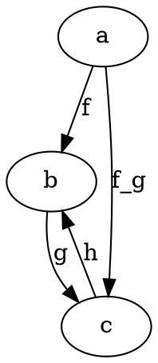

Q: "Is an OCaml functor actually a functor?"

A: An OCaml functor is not the same as an abstract functor, but it is an instance of a functor on the category of OCaml modules.

An OCaml functor takes, as argument, an OCaml module, and returns an OCaml module.

An Ocaml module, D, may be declared by

```ocaml
module D = struct

  type t = int -> unit

  let x = fun -> 7

  ...

end
```

The module type of D is called its signature. It is identified by the collection of all types and values in D:

```ocaml
module type DSig = sig

  type t = int -> unit

  val x: unit -> int

  ...

end
```

Modules are first-class values. We can, for instance, alias modules, and we can nest modules inside of other modules. It is not inappropriate to think of the module signature as being the type of the module.


If we declare another signature, CSig:

```ocaml
module type CSig = sig

  ...

end
```

then we can proceed to declaring an OCaml functor:

```ocaml
functor F(D: DSig): CSig = struct

  ...

end
```

In the ellipsis, we declare an ordinary module, and D is available as an argument in our declarations. Types in D become subtypes in the type declarations, and values in D become sub-values in the value declarations.

Modules can be considered as an instance of a Category, if we take types to be objects, and values (expressions) to be arrows.

ex.

```ocaml
module MyCat = struct

  type a = ...
  type b = ...
  type c = ...

  let f: a -> b =
    ...

  let g: b -> c =
    ...

  let f_g: a -> c = 
    fun a -> g (f a)

  let h: c -> b =
    ...

end
```

yields the diagram



We obtain that, for an OCaml functor to be a functor over the category of an OCaml module, 
it must take types to types and values to values. 
We have already observed that types are available in the context of our functor declaration, 
and as well, can only be used in the construction of other types. 
The same holds, analogously, for values. 
We conclude that the OCaml functor is an instance of a functor over the category of an OCaml module.
